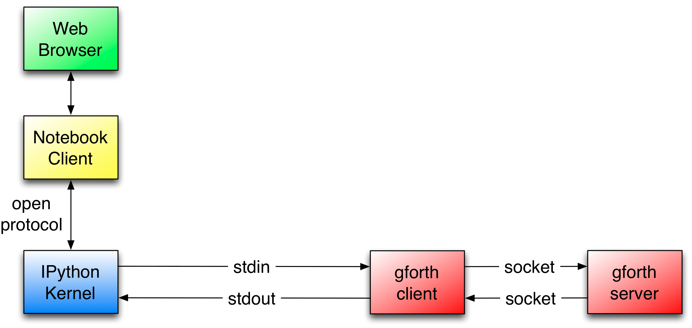

# Forth Notebooks #

## Introduction ##

This is an integration of Forth (currently the [gforth](https://www.gnu.org/software/gforth/) system)
with [IPython notebook](http://ipython.org/notebook.html).

IPython notebook allows external programs to be called by a mechanism called
[cell magic](http://ipython.org/ipython-doc/stable/interactive/reference.html#magic-command-system)
which passes the cell content of an IPython notebook to stdin of the external program and its stdout
will become the cell result.

Forth notebooks follows this architecture:

The %%gforth cell magic will call the gforth client which communicates via
sockets with the gforth server system. This way the gforth server can maintain
system state as only the client is repeatedly invoked.

IPython's client server message protocol is documented in a 
[public specification](http://ipython.org/ipython-doc/stable/development/messaging.html#messaging).

## Installation ##
Forth Notebooks has been used with Linux and Mac OS X installations of IPython notebook.

### Configure the cell magic %%gforth

In your ~/.ipython/profile_default/ipython_config.py file
add gforth magic, so the file looks like:

    # If you want to add script magics that aren't on your path, specify them in
    # script_paths
    c.ScriptMagics.script_magics=['sh', 'bash', 'perl', 'ruby', 'gforth']

    # Dict mapping short 'ruby' names to full paths, such as '/opt/secret/bin/ruby'
    #
    # Only necessary for items in script_magics where the default path will not find
    # the right interpreter.
    c.ScriptMagics.script_paths = {
        'gforth' : 'python $HOME/forth-notebooks/forth-client.py' 
    }

### Create forth-in and forth-out pipes

Run the command setup.sh
    
    $ source setup.sh

or inspect the file and run its commands manually if you don't want to run arbitray
shell files with your access rights.

## Running Forth notebooks

1. In order to run Forth notebooks you first start the forth server like:

    $ gforth gforth-server.fs -e 'start'

2. Start IPython notebook:

    $ ipython notebook --matplotlib=inline

3. Once your browser starts with IPython, open one of the sample notebooks such as 
   hello-forth.pynb .

 

